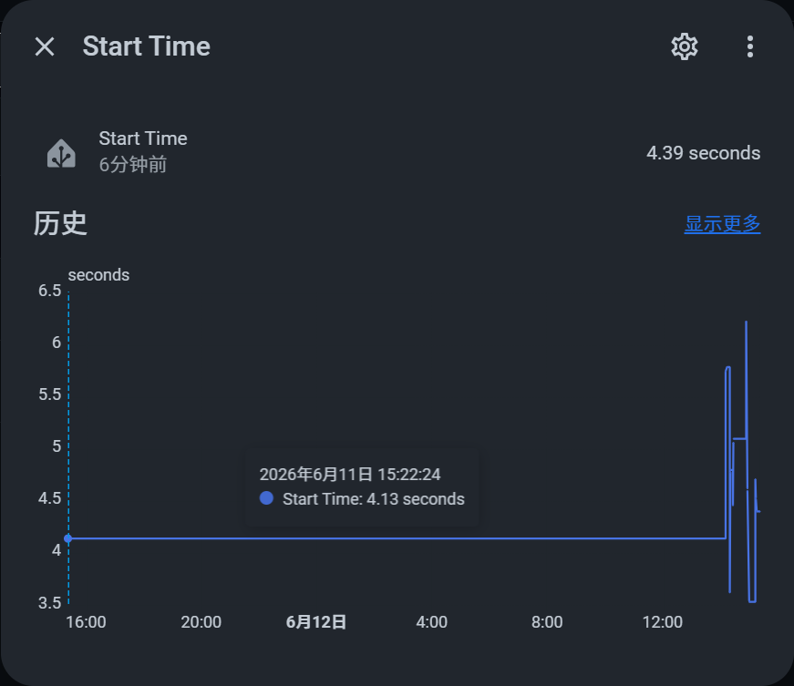
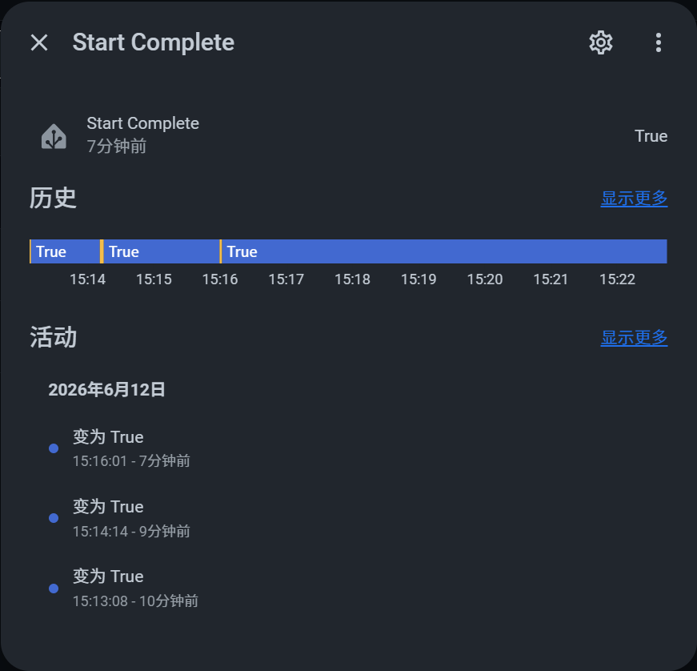

# StartTime for Home Assistant 修改版

[](https://github.com/custom-components/hacs)

创建一个启动时间传感器

创建一个启动完成传感器


## 安装
### 方式一：通过 HACS 安装（推荐）
1. 确保已安装 [HACS](https://hacs.xyz/)
2. 在 HACS 的「集成」页面中，点击右上角的「⋮」按钮，选择「自定义存储库」
3. 输入以下信息： 存储库: https://github.com/flamestsui/StartTime
   类别: 集成
4. 点击「添加」。
5. 在 HACS 的「集成」页面中搜索 StartTime，然后点击「下载」。
6. 下载完成后，重启 Home Assistant。

### 方式二：手动安装
1. 将 `StartTime` 文件夹复制到 Home Assistant 的 `custom_components` 目录：
2. 重启 Home Assistant。

## 配置

**方法1** GUI:

> 设置 > 集成 > 添加集成 > **StartTime**

如果该集成未出现在列表中，您需要清除浏览器缓存。
**方法2.** YAML:

```yaml
start_time:
```

## 关于

Home Assistant在信息日志中显示初始化时间。该组件显示的时间与传感器相同。

对于调试像树莓派这样的慢速计算机的性能非常有用。

此组件不依赖于`logger`组件的设置！

```
2020-02-24 17:13:11 INFO (MainThread) [homeassistant.bootstrap] Home Assistant initialized in 25.5s
```
